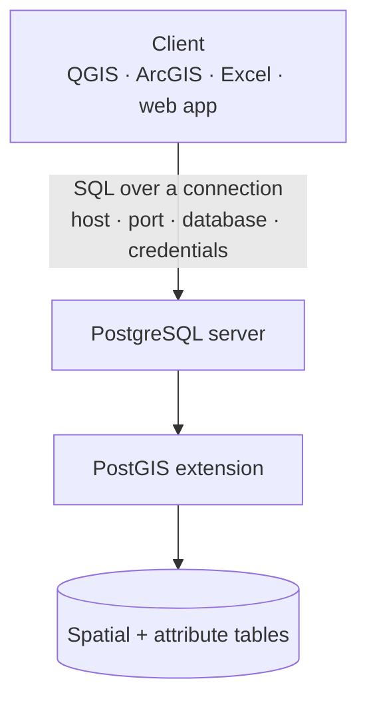
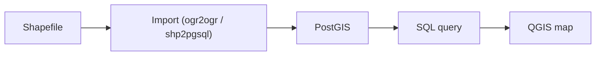

PostGIS is usually approached through installation steps and SQL syntax, but the concepts underneath make it far easier to use. This guide condenses the fundamentals — spatial databases, PostgreSQL, PostGIS, and SQL — into a reference you can scan to refresh the material without rewatching the lectures.

## Architecture at a Glance

A client sends SQL over a connection to a PostgreSQL server; the PostGIS extension adds spatial storage and functions on top of it.



## Core Terminology

| Term                 | Meaning                                                      |
| -------------------- | ------------------------------------------------------------ |
| **GIS**              | Geographic Information System — software for storing, viewing, and analyzing spatial data. |
| **QGIS**             | Open-source desktop GIS. In this context it is the client used to send SQL to the database and view results. |
| **Enterprise GIS**   | An integrated GIS accessible across an organization. More than shared files on a network drive: it can include per-user access control, editing permissions, and automated business logic. |
| **Spatial database** | A centralized store for spatial data, with built-in features for spatial storage and analysis. Often handles access control and business logic too, but that is not required. |
| **PostgreSQL**       | Open-source relational database. Among the most standards-compliant relational databases available. |
| **PostGIS**          | Open-source spatial extension for PostgreSQL. Adds storage, management, and analysis of spatial data. Used throughout the course. |
| **Client–server**    | An architecture where one server provides resources to many clients on request. |

> Enterprise GIS and spatial database are related but not synonyms. Enterprise GIS is the organization-wide system; the spatial database is the centralized data store it usually sits on.
> {: .prompt-info }

### Client and Server Are Software, Not Machines

Clients and servers are commonly pictured as physical computers, but both are software:

- **Server software** sits idle until a client makes a request, then returns a result (a file, a query result, a web page, the current time, etc.).
- **Client software** knows how to form a request and process the response.
- A server can run on one machine or a distributed network. The client and server can also run on the **same** machine — which is how the course runs PostGIS locally.

## Why Use a Spatial Database

Most of these benefits come from the underlying **RDBMS** (Relational Database Management System) — the same class of software behind banks, Amazon, Wikipedia, and Facebook — not from the spatial features specifically.

**Performance and scale**

- **Speed.** Vendors like Oracle, IBM, and Microsoft invest heavily in optimizing data retrieval and indexing. The database also runs on a server that is typically more powerful than a desktop, so complex queries run server-side are usually faster than loading files onto a client and processing them there.
- **Scalability.** If one server is overloaded by many concurrent users, add replicas to scale out.

**Reliability**

- **Transactions.** A logical sequence of operations is wrapped so nothing is written until the whole sequence succeeds (then it is committed). If a crash occurs mid-sequence, nothing is saved and the data stays in a known state.
- **Replication.** The full database is copied to another disk, machine, or city. If hardware fails, data remains available from a replica. Replicas also increase capacity and speed.
- **Data integrity.** Validation rules can be built into the database to catch obvious errors on entry.

**Security and access**

- **Access control.** Each user authenticates with credentials and is granted privileges (create / edit / delete) at the schema, table, or field level. This limits accidental damage — e.g. an intern deleting data they should not touch.
- **External security.** Enterprise databases are hardened against outside attacks. Login credentials are required, and stored data is not exposed as browsable files (see *Where the Database Lives*).

**Collaboration and flexibility**

- **Concurrent editing.** Multiple users can edit the same data simultaneously, from different clients. File-based storage typically locks the data to a single editor while others are locked out — a common source of frustration that only a spatial database resolves.
- **Multiple client types.** The same data can be reached from QGIS, ArcGIS, non-spatial tools (Excel, Access), custom programs (Python, Visual Basic), or a web map.
- **SQL flexibility.** SQL provides a flexible, standardized way to query, create, and analyze data.

### The Main Advantage: One Integrated Store

The strongest reason is a single store that integrates **non-spatial data with spatial data**.

Desktop software can join a non-spatial table to a spatial layer through a common key, which works well for **one-to-one** relationships. It gets difficult with **one-to-many** or **many-to-many** relationships and dozens of related tables (for example, complex soils datasets). A spatial database handles this cleanly, because spatial and non-spatial data can be combined in a single query regardless of relationship complexity.

> Practical case: an oil-and-gas project managed project schedules, contacts, and status in a separate Access database while spatial constraints lived elsewhere. Keeping spatial and non-spatial data in incompatible stores was the core pain point. A spatial database treats it all as data in one place.
> {: .prompt-tip }

## What a Spatial Database Actually Is

A "spatial database" is more precisely a **spatially-enabled database**: an extension to an existing database that lets it store, retrieve, and usually analyze spatial data. The base database is just the engine — an external client handles the user interface.

### Common Implementations

| Product        | Notes                                                        |
| -------------- | ------------------------------------------------------------ |
| **SpatiaLite** | Spatial extension to SQLite. File-based (not client–server), embeddable, tightly integrated with QGIS. Good for smaller projects; no server install. |
| **PostGIS**    | Spatial extension to PostgreSQL. True client–server, scales to multi-terabyte databases, open source, standards-based. Used in this course. |
| **SQL Server** | Microsoft, commercial. Includes spatial functionality out of the box, but historically lacks coordinate-system transformation. |
| **Oracle**     | Long-established; spatial extension available, typically at extra cost for full functionality. |
| **MySQL**      | Open source. Older versions ran spatial functions only against the bounding box, not the exact geometry — unsuitable for most GIS work until later versions. |
| **ArcSDE**     | Esri's spatial extension that runs on top of SQL Server, Oracle, or PostgreSQL. |

> **ArcSDE caveat.** Editability depends on the setup. Data written via one path may only be viewable (not editable) via another. If you use a spatial database other than PostGIS, verify for yourself which clients can edit it and what licensing level is required.
> {: .prompt-warning }

### Standards

- **Simple Features for SQL** (Open Geospatial Consortium): defines how to store vector geometry and the functions to work with it. Followed closely by SpatiaLite, PostGIS, and SQL Server; Oracle implements it differently.
- **SQL/MM** (SQL Multimedia, an ISO standard): extends Simple Features with additional geometry types and formats. Implemented to varying degrees.

Databases also add non-standard functions — for example, exporting geometry as **GeoJSON**, which is convenient for web applications.

### How Geometry Is Stored

Vector geometry is stored as a binary object in a **BLOB** (Binary Large Object) field — the same field type used for images, audio, or video. Binary storage is compact but hard to read directly, so the Simple Features standard provides functions to output coordinates in human-readable text. In practice you rarely touch the binary form directly — PostGIS exposes geometry through SQL functions.

### Geometry Types

PostGIS geometry columns hold standard OGC types:

- **POINT** — a single location.
- **LINESTRING** — a connected series of points (roads, streams).
- **POLYGON** — a closed area, optionally with holes (parcels, lakes).
- **MULTIPOINT / MULTILINESTRING / MULTIPOLYGON** — collections of the above (e.g. an island group as one MULTIPOLYGON).
- **GEOMETRYCOLLECTION** — a mix of geometry types in one value.

### Coordinate Systems (SRID)

Every PostGIS geometry also stores an **SRID** (Spatial Reference Identifier) that identifies its coordinate reference system (for example, `4326` for WGS 84). Operations between geometries generally require matching SRIDs; use `ST_Transform` to convert a geometry from one SRID to another.

### Function Notation Differs by Product

Even where products share the same functions, they call them differently. To buffer a geometry:

```sql
-- PostGIS: function notation
ST_Buffer(geom, 400)
```

```sql
-- SQL Server: object/method notation
geom.STBuffer(400)
```

Both do the same thing. Many PostGIS statements convert to SQL Server by adjusting notation and removing the underscore from the function name.

### Raster Data

Many spatial databases also store and analyze raster data, though less standardized than vector. In PostGIS, rasters are split into tiles; each tile is stored as an image in a BLOB field, one tile per row. Loading rasters takes more effort, but raster operations then run server-side — usually faster than on a desktop client.

### Spatial Indexing

An index makes lookups faster, like a book's index versus reading every page. Spatial indexes rely on the **bounding box**: the database tests the simple bounding-box relationship first, and only runs the expensive exact-geometry test when the bounding boxes actually interact.

Why it matters — counting points in polygons:

- 1,000 points × 1,000 polygons → up to **1,000,000** point-in-polygon tests.
- 100,000 points × 10,000 polygons → up to **1,000,000,000** tests.
- Complex polygons (thousands of vertices, holes, multiple parts) make each test expensive.

A spatial index eliminates most candidates with the cheap bounding-box check first, so the expensive test runs only a handful of times instead of thousands — an enormous saving.

### Underlying Open-Source Libraries

PostGIS (like most open-source GIS tools, including QGIS and GDAL) leans on shared, well-tested libraries rather than reinventing spatial code:

| Library  | Purpose                                                      |
| -------- | ------------------------------------------------------------ |
| **GEOS** | Vector geometry operations (relationship tests, overlays).   |
| **PROJ** | Transforming coordinates between reference systems.          |
| **GDAL** | Reading/writing raster data in almost any format; raster analysis. |
| **OGR**  | Reading/writing vector data in almost any format (part of GDAL). |

> Because these libraries are shared, standardized, and thoroughly tested, skills learned on one open-source spatial tool transfer well to others. Proprietary algorithms are often undocumented by comparison.
> {: .prompt-tip }

## Where the Database Lives

With file-based data (e.g. a shapefile) you navigate the file system to find, move, rename, or email the file. With a spatial database, the data is **not** accessible through the file system in any meaningful way — you reach it only through the database software.

This is a security benefit. Renaming or deleting the underlying files is far harder, and an attacker browsing the file system cannot easily identify the data, since it is stored as files with opaque numeric names. Database credentials are still required regardless.

### The Database Connection

A client reaches the database through a **connection string** carrying five pieces of information:

| Piece             | Description                                                  |
| ----------------- | ------------------------------------------------------------ |
| **Host**          | Name, IP address, or domain of the computer where the database lives. |
| **Port**          | Number identifying which server software receives the request. PostgreSQL default: **5432**. |
| **Username**      | Credential for authentication.                               |
| **Password**      | Credential for authentication.                               |
| **Database name** | One PostgreSQL instance can hold several databases; you connect to one at a time. |

With these five values and the required privileges, the client can access the data and do anything the client supports.

### Hosting Options

- **Localhost.** Database runs on the same machine as the client (`host = localhost`). Used for development and testing before deploying to a shared server. This is the course setup.
- **Intranet / company server.** Database on an internal server, not reachable through the organization's firewall. Good for security and performance (wired internal network is faster than the internet). Requires IT to install and provide access details.
- **Remote server.** Accessible over the internet — less secure and slower, but enables web pages and mobile apps. Smaller organizations often rent hosting for a few dollars a month on a fixed monthly plan.
- **Cloud.** Conceptually similar to a remote server (paying to use someone else's hardware), but billed by resources used (memory, storage, bandwidth) rather than a fixed price. Cloud services are typically **elastic** — resources scale automatically under load, which also scales cost, so monitor usage.

> Regardless of where it lives, you always need host, port, database name, and login credentials to connect. Once connected, it behaves like any other data source.
> {: .prompt-info }

## SQL Essentials

### What SQL Is

SQL (Structured Query Language) is a standardized, text-based way to interact with a database. Almost anything you can do with a database can be done through a SQL statement. Even when you click through a graphical interface, the UI is converting those clicks into SQL and sending it to the database.

- Standardized by **ANSI** (from 1986); origins in the early 1970s at IBM.
- The way we interact with databases has changed little, even as the databases themselves became faster, more robust, more secure, and more scalable.
- Each database adds its own quirks and extensions, so only simple statements are perfectly portable — but differences are generally minimal.

### Declarative vs Imperative

SQL is **declarative**: you state *what* you want and the database determines *how* to get it. This contrasts with **imperative** languages (Python, Visual Basic, C++, JavaScript), where you specify each step. Disliking imperative coding is not a reason to avoid SQL — the model is different.

### The Four Sub-Languages

| Sub-language                         | Purpose                                                      |
| ------------------------------------ | ------------------------------------------------------------ |
| **DQL** — Data Query Language        | Querying data. Used most of the time.                        |
| **DDL** — Data Definition Language   | Creating tables and defining structure (fields, indexes, relationships). Mostly used at design time. |
| **DML** — Data Manipulation Language | Adding and changing data in existing tables.                 |
| **DCL** — Data Control Language      | Defining users and roles and assigning access privileges.    |

Beyond the standard, most databases add **procedural extensions** for custom functions and procedures. These are far less portable. PostgreSQL supports procedures in several languages (C, Python, JavaScript, and others). Spatial functions are also extensions, so spatial SQL transfers between databases less cleanly than standard SQL.

### Ordinary SQL First

Non-spatial SQL is worth reading before spatial SQL, because spatial queries are the same structure with spatial functions added. Filter rows with `WHERE`:

```sql
SELECT name, population
FROM cities
WHERE population > 100000;
```

Sort results with `ORDER BY`:

```sql
SELECT name
FROM cities
ORDER BY population DESC;
```

### Anatomy of a Statement

SQL statements are built from clauses, expressions, and predicates.

- **Clauses** are the keywords of the language (e.g. `SELECT`, `FROM`, `WHERE`). Capitalizing them is convention, not a requirement — SQL is case-insensitive — but it aids readability.
- **Expressions** return a value. `1 + 2` returns `3`. A bare field name is the simplest expression; functions are expressions too. A spatial example: `ST_Buffer(geom, 400)` returns a buffer geometry 400 m around the input.
- **Predicates** return TRUE, FALSE, or UNKNOWN — the conditional expressions of SQL. `1 = 2` is FALSE; `3 < 4` is TRUE. Spatial predicate example: `ST_Contains(a, b)` returns TRUE if geometry `a` contains geometry `b`.

A spatial query reusing the same clauses:

```sql
SELECT nest_spec, nest_stat, ST_Distance(geom, home)
FROM nests
WHERE nest_spec = 'RTHA'
ORDER BY nest_stat, nest_id;
```

- `SELECT` — the expressions that form the result set. Here: two fields plus `ST_Distance`, which returns the distance between each geometry and a reference geometry `home`.
- `FROM` — the table(s) the results come from.
- `WHERE` — limits results to rows where the predicate is TRUE. Here, only red-tailed hawks (`nest_spec = 'RTHA'`).
- `ORDER BY` — sorts the result, by status then nest ID.

> Strings in PostgreSQL are delimited by **single quotes** (`'RTHA'`), not double quotes.
> {: .prompt-warning }

### Why Write SQL Instead of Clicking

A statement is just text passed to the server, which processes it and returns a result set. That has practical consequences:

- **Reusable.** Save a statement and rerun it for identical results, avoiding repeated manual steps and the mistakes they invite.
- **Editable.** Change a value and rerun — no need to click through a GUI again. Changing a 400 m buffer to 800 m is a one-character edit.
- **Portable.** Copy and paste the same statement between tools; behind the scenes they all run SQL. ArcGIS and QGIS expose the SQL a GUI query generates.
- **Transferable across software.** GUI workflows must be relearned when the organization switches tools. SQL knowledge does not expire — it has been standard for decades and is widely taught.
- **Sendable.** Email a query to a colleague, or store it in the database for later. Useful when you are out of the office and someone needs an answer.
- **Web-friendly.** A web page can send SQL to the database via an AJAX request and return results.
- **Backup and migration.** An entire database can be exported as plain text (INSERT statements). Being human-readable, it is almost guaranteed to restore, and it migrates cleanly to new servers or software versions.

### The 80/20 Rule

Basic SQL is straightforward, but it scales to multi-table joins, aggregate functions, lookup tables, and spatial functions. Per the **Pareto principle** (80% of results from 20% of effort), you can likely accomplish about 80% of your work with roughly 20% of the language. Learn the basics first; the rest follows as needed.

## Typical Workflow

The concepts above connect into one path: get data in, query it in the database, and view results in a client.



## Quick-Reference Summary

| Topic               | Key point                                                    |
| ------------------- | ------------------------------------------------------------ |
| **Stack**           | QGIS (client) → PostgreSQL + PostGIS (spatial database).     |
| **Biggest benefit** | One store integrating spatial and non-spatial data, including complex many-to-many relationships. |
| **RDBMS benefits**  | Speed, access control, replication, transactions, concurrent editing, scalability. |
| **Storage**         | Vector geometry in BLOB fields; rasters as tiled images, one tile per row. |
| **Geometry types**  | POINT, LINESTRING, POLYGON, and MULTI variants; each carries an SRID. |
| **Standards**       | Simple Features for SQL (OGC); SQL/MM (ISO).                 |
| **Libraries**       | GEOS (geometry), PROJ (projections), GDAL (raster I/O), OGR (vector I/O). |
| **Indexing**        | Bounding-box test first, exact geometry only if it passes.   |
| **Connection**      | Host, port (5432), username, password, database name.        |
| **Hosting**         | localhost (dev), intranet, remote, cloud (elastic, usage-billed). |
| **SQL**             | Declarative; DQL / DDL / DML / DCL; clauses, expressions, predicates. |
| **SQL functions**   | `ST_Buffer`, `ST_Distance`, `ST_Contains`, `ST_Transform`; single-quoted strings. |

## Next Steps

Logical follow-on topics for hands-on practice:

- Installing PostgreSQL and PostGIS
- Connecting QGIS to a PostGIS database
- Importing data with `ogr2ogr` or `shp2pgsql`
- Writing your first spatial queries
- Spatial joins and indexing in practice